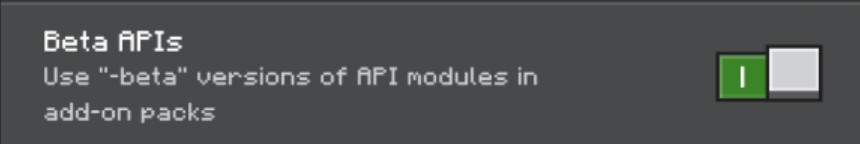

# DiscordCC: Bedrock Edition

This is a Minecraft Bedrock Edition script that allow players to chat with people from a discord channel. It's a rich with features, providing simple and better interaction with the users.

> [!NOTE]
> This script is **ONLY AVAILABLE** for dedicated servers. Therefore, you can't use this in client-side or realms.

## Requirements
- BETA APIs enabled
- @minecraft/server-net

## Instalation
First, you must download the DiscordCC pack that you can find in [CurseForge](https://www.curseforge.com/minecraft-bedrock/addons/discordcc). After that, you can now upload it to your minecraft server's in `development_behavior_packs` folder. Your server must have BETA APIs enabled and "@minecraft/server-net" is included in the server's configuration. More detailed information [here](docs/INSTALLATION.md)

## Feature
While we currently developing DiscordCC, these are the following available features:
- Relay Chat between a discord channel and minecraft server.
- Event notifications, such as join, left, death, server start, and server stop.
- Useful discord slash commands allowing better and efficient interaction. You may check the [commands list here](docs/COMMANDS.md).

more features will be added in the near future!

## References
DiscordCC offers API frameworks that could be use by any other scripts/add-ons. Visit [here](docs/REFERENCES.md) to view more.

## Contributions
### Reporting Bugs
If you encounter any bugs while using DiscordCC, please open an [issue](https://github.com/IndeedItzGab/DiscordCC/issues/new) in our github repository. Ensure to include a detailed description of the issue and steps to reproduce it.
### Submitting a Pull Request
We appreciate code contribution for this project. Especially if you have fixed a bug or implemented a new feature, you may submit a pull request.
Please ensure your code follows our coding standard and includes tests where possible.

## Copyright
© 2025 IndeedItzGab. All rights reserved.
- You may not distribute this project without explicit permission and proper credit.
- You may modify this project for **personal use only**.

## Support Me
- [PayPal](https://www.paypal.me/GabrielBondoc09)

## Contact
- Discord Server: https://discord.gg/23vG3Np6AH
- Twitter/X: https://x.com/IndeedItzGab?t=UL3bhR8CksHJSWn89duhuA&s=09