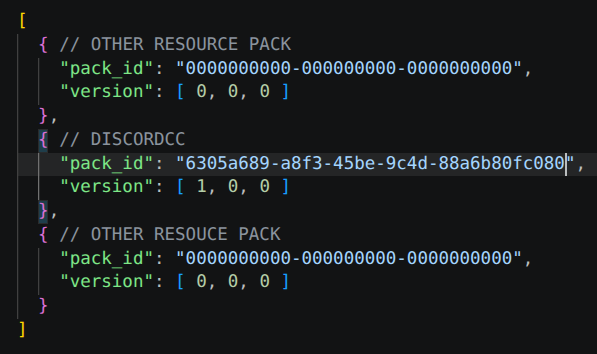
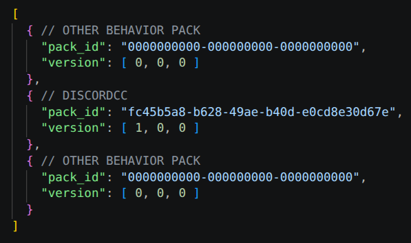
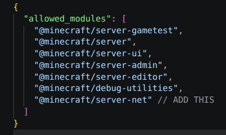
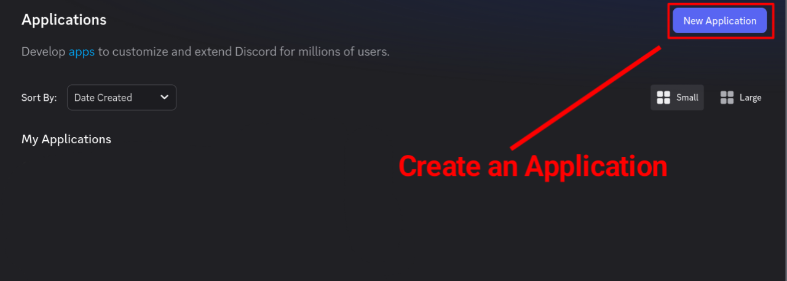
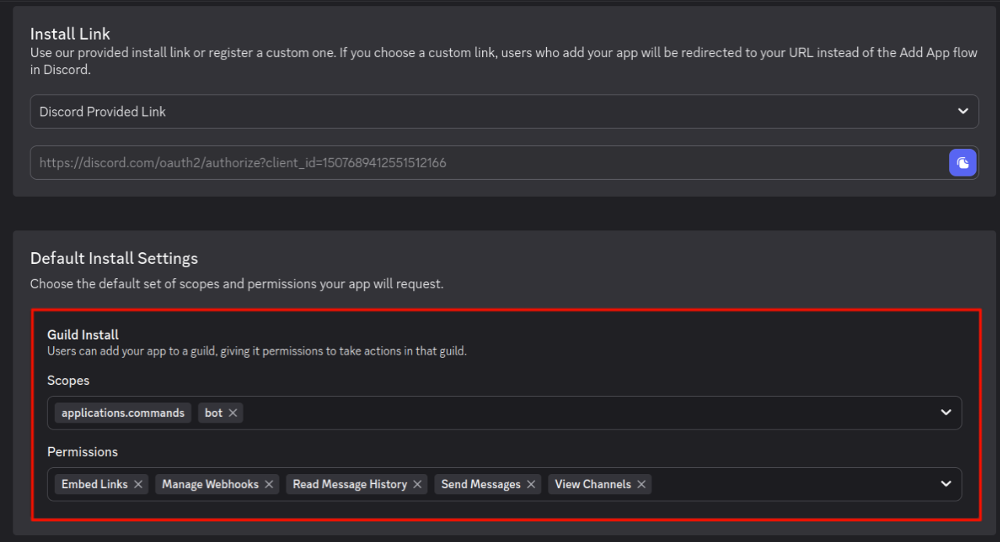
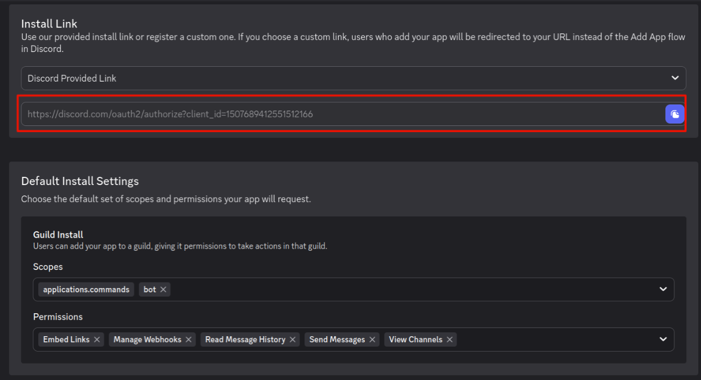
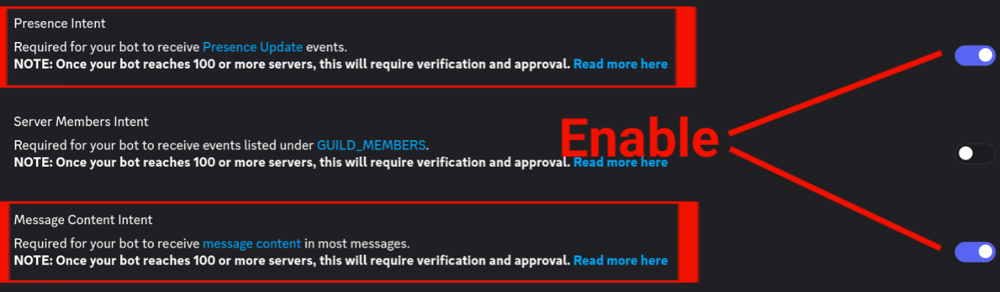
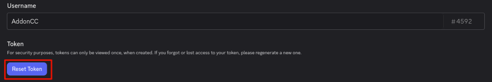

# Installation
Note that this script only support **Bedrock Dedicated Server**.

## Method 1: Native Installation
This installation is applicable for most minecraft bedrock hosting services where they allow users to do almost everything with the rented server. The instructions below is not detailed as it seems to be. Therefore, if you have any question please join our [Discord Server](https://discord.gg/gWyk8MZKtM) to ask for support.

### Step 1: Enabling BETA APIs
1.) Create a local world in your Minecraft client
2.) Navigate to the **Experiment** menu and enable **BETA APIs** option.

3.) Start creating the world, then after creating. Export the world from your Minecraft client.
4.) Import the exported world with BETA APIs enabled to your Minecraft Bedrock Dedicated Server

### Step 2: Download & Server Installation
1.) Download the latest pack from [CurseForge](https://www.curseforge.com/minecraft-bedrock/scripts/discordcc/files/latest) or [Github](https://github.com/IndeedItzGab/DiscordCC/releases/latest)
2.) Extract it to folder and upload the project folder to your server's `server/files/development_behavior_packs` directory.
2.) Edit or create file named `world_resource_pack.json` inside your active world's folder and add the DiscordCC resource pack UUID and version.

3.) Edit or create file named `world_behavior_pack.json` inside your active world's folder and add the DiscordCC behavior pack UUID and version.

4.) Open your server's permissions config file located at `server/files/config/default/permissions.json` and ensure `"@minecraft/server-net"` is allowed.

### Step 3: Discord Bot Setup
1.) Go to the [Discord Developer Portal](https://discord.com/developers/applications) and create a new application/bot.

2.) Navigate to the **Installation** menu, scroll down to **Default Setting Installation**, select the "**bot**" scope, and enable these listed permissions to **permissions**:
  - **View Channels** - Required to monitor the new messages to be sent to minecraft server.
  - **Read Message History** - Required for fetching the message reference (user replied to a message)
  - **Manage Webhooks** - Required for handling webhook to the specified channel for sending messages from players.
  - **Send Messages** - Required for the bot to send a message to the specified channel.
  - **Embed Links** - Required for the bot to be able to send embeded messages.

3.) Use the provided installation link on that page to invite the bot to your Discord server.

4.) Go to the **Bot** menu and enable both **Presence Intent** and **Message Content Intent**.

5.) Reset and copy the bot's token, then paste it into the configuration file of the DiscordCC pack.

6.) Copy the ID of the channel you want discord users and minecraft players to communicate.

## Aternos
Soon
