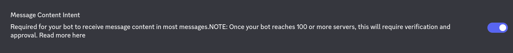

# Installation
Note that this script only support **Bedrock Dedicated Server**.

### Method 1: Native Installation
This installation is applicable for most minecraft bedrock hosting services where they allow users to do almost everything with the rented server. The instructions below is not detailed as it seems to be. Therefore, if you have any question please join our [Discord Server](https://discord.gg/gWyk8MZKtM) to ask for support.
1.) Install the script from [CurseForge](https://www.curseforge.com/minecraft-bedrock/addons/discordcc)

2.) Upload the script in the `development_behavior_packs` folder at your server files. Make sure it is decompresses from `.mcpack` to a folder.

3.) Add the "@minecraft/server-net" in the `config/default/permission.json`. The file content must look like this:
```json
{
  "allowed_modules": [
    "@minecraft/server-gametest",
    "@minecraft/server",
    "@minecraft/server-ui",
    "@minecraft/server-admin",
    "@minecraft/server-editor",
    "@minecraft/server-net"
  ]
}
```
4.) Make sure that the **BETA APIs** is enabled in your world's experimental setting.

5.) You must create a discord bot application from [Discord Development Portal](https://discord.com/developers/applications). After creating one, head to `Installation` menu in the left panel and scroll down till you see "Default Install Setting". Then, add "Bot" and "applications.commands" in the **Scopes**, and "Read Message History" and "View Channels" in the **Permissions**.

6.) Head to `Bot` menu in the left panel and make sure that the discord bot must have a **Message Content Intent** and **Presence Intent** enabled that you can see in the page.


6.) On the same page, find the "**token**" section and reset it. It should show the discord bot's token that should be included in the `config.js` at the script folder files.

7.) Select a discord channel that you want to connect with minecraft server. Then, copy the channel id and paste it on the configuration file of the script.

8.) Your discord bot should have a proper role permission in order for it to read the messages sent from the specified channel.

9.) After that, go to the channel setting that you copied id and create a webhook from that channel. Then, copy the webhook url and paste it at the configuration file of the script.

10.) You can now play with DiscordCC, if you found a problem. Please contact me.

### Aternos
Soon
